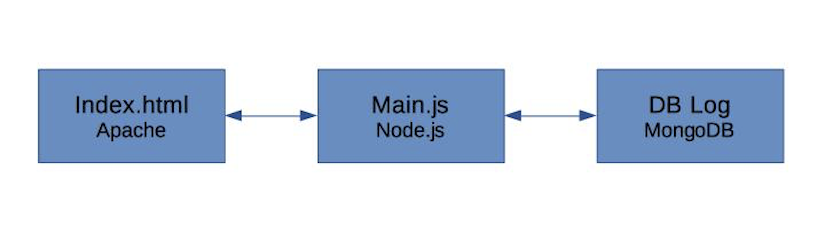

# M300_LB2

NextCloud mit mysql
----------
Vagrantfile:
```
Vagrant.configure("2") do |config|

  config.vm.box = "ubuntu/xenial64"

  # Create a public network, which generally matched to bridged network.
  #config.vm.network "public_network"
  config.vm.network "private_network", ip:"192.168.60.101" 
  config.vm.network "forwarded_port", guest:8080, host:8080, auto_correct: true
  
  # Share an additional folder to the guest VM.
  # config.vm.synced_folder "../data", "/vagrant_data"

  config.vm.provider "virtualbox" do |vb|
     vb.memory = "2048"
  end

  # Docker Provisioner
  config.vm.provision "docker" do |d|
   d.pull_images "mysql"
   d.pull_images "nextcloud"
   d.run "nextcloud_mysql", image: "mysql", args: "-e MYSQL_ROOT_PASSWORD=secret -e MYSQL_USER=nextcloud -e MYSQL_PASSWORD=secret -e MYSQL_DATABASE=nextcloud --restart=always"
   d.run "nextcloud", image: "nextcloud", args: "--link nextcloud_mysql:mysql -p 8080:80 --restart=always"
  end
end

```
Ich habe 2 Images verwendet. Das erste Image ist mysql und das 2. Image ist nextcloud.
Anschliessend wird mysql ausgeführt. Es werden folgende Paramter verwendet:
* MYSQL_ROOT_PASSWORD=secret
* MYSQL_USER=nextcloud
* MYSQL_PASSWORD=secret
* MYSQL_DATABASE=nextcloud

Für den nextcloud Container habe ich folgende Paramter verwendet:
* --link nextcloud_mysql:mysql
* -p 8080:80
* --restart=always


Konzept
----------




Apache
---------
### Dockerfile
```
FROM ubuntu:16.04
MAINTAINER Tim Rhomberg <timrhomberg@hotmail.com>

RUN apt-get update
RUN apt-get -q -y install apache2 

ENV APACHE_RUN_USER www-data
ENV APACHE_RUN_GROUP www-data
ENV APACHE_LOG_DIR /var/log/apache2

RUN mkdir -p /var/lock/apache2 /var/run/apache2

EXPOSE 80

VOLUME /var/www/html

CMD /bin/bash -c "source /etc/apache2/envvars && exec /usr/sbin/apache2 -DFOREGROUND"
```

### Index.html
```
<!DOCTYPE html>
<html>
    <head>
        <meta http-equiv="Content-Type" content="text/html; charset=UTF-8">
        <script src="https://ajax.googleapis.com/ajax/libs/jquery/3.3.1/jquery.min.js"></script>
        <title>DNS NSLOOKUP Service</title>
        <script>
            $(document).ready(function() {

                var x = document.getElementById("domainname").value;
                $("button").click(function() {
                    $.get("http://localhost:8081/?google.ch", function(data) {
                        $("#dn").html(data);
                        document.getElementById("mytext").value = data;
                    });
                });
            });

        </script>
    </head>
    <body>
    <h1>DNS NSLOOKUP Service</h1>
        
    Domainname name: <input id="domainname" type="text" name="domainname"><br>
    <button>Click me</button>
    <p id="dn"></p>
        <input type="text" id="mytext">
    </body>
</html>
```

### Container starten
```
docker build -t apache .
docker run -d -p 1000:80 -v ~/M300_LB2/apache/web:/var/www/html --name apache apache
```

Node.js
---------
### Dockerfile
```
FROM node:9.11.1
MAINTAINER Tim Rhomberg <timrhomberg@hotmail.com>

EXPOSE 8081

VOLUME /opt/node

CMD /opt/node/main.js
```

### main.js
```
var http = require("http");
var url = require('url');
var querystring = require('querystring');
const dns = require('dns');

http.createServer(function (request, response) {
    pathName= url.parse(request.url).pathname;
    query= url.parse(request.url).query;
    console.log('pathName = ' + pathName);  
    console.log('query = ' + query);  
	console.log(query);
	dns.lookup(query, (err, address, family) => {
	  response.writeHead(200, {'Content-Type': 'text/plain'});
	  // response.write('Domain: ' + query + '\n');
	  response.write('IPv' + family + ' Adresse: ' + address);
	  response.end();
console.log(request);
	});

   // Send the HTTP header 
   // HTTP Status: 200 : OK
   // Content Type: text/plain
   // response.writeHead(200, {'Content-Type': 'text/plain'});

   // Send the response body as "Hello World"
   // response.end('Hello World\n');
   
   // console.log(request);
}).listen(8081);

// Console will print the message
console.log('Server running at http://127.0.0.1:8081/');

```

### Container starten
```
docker build -t nodejs .
docker run -d -p 1100:8081 -v ~/M300_LB2/nodejs:/opt/node --name nodejs nodejs
```
